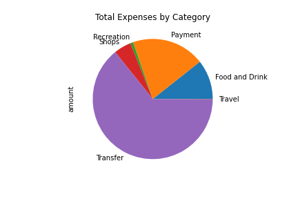
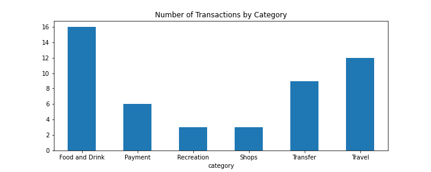
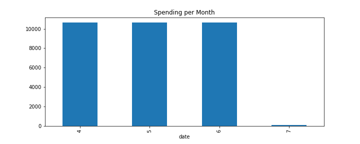
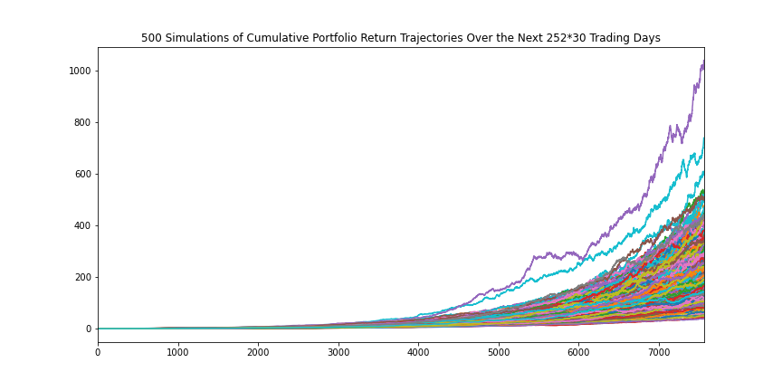
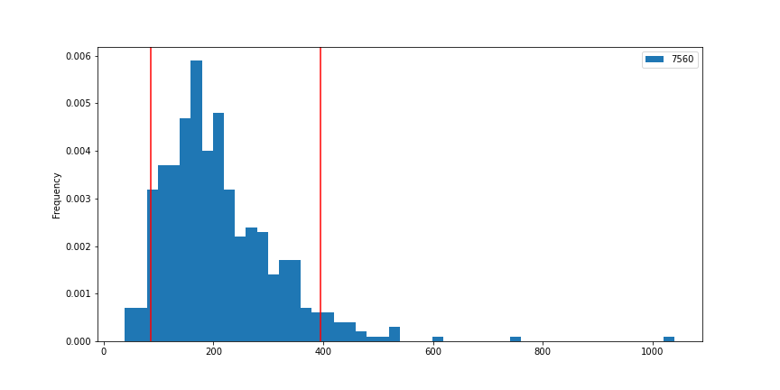
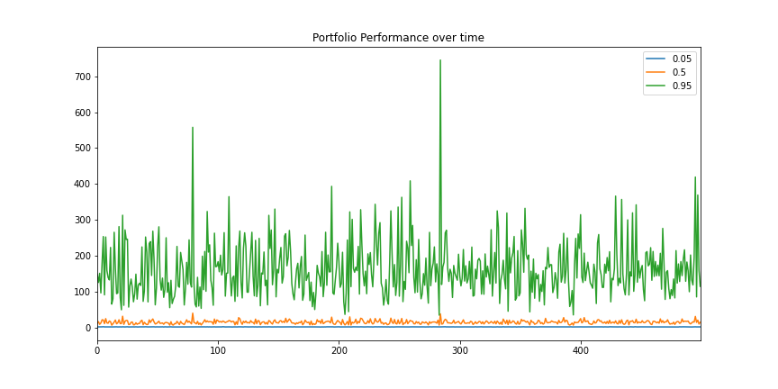
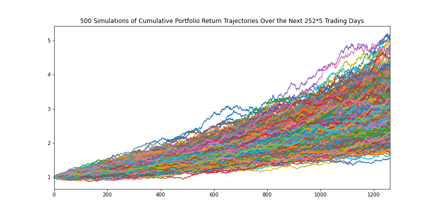
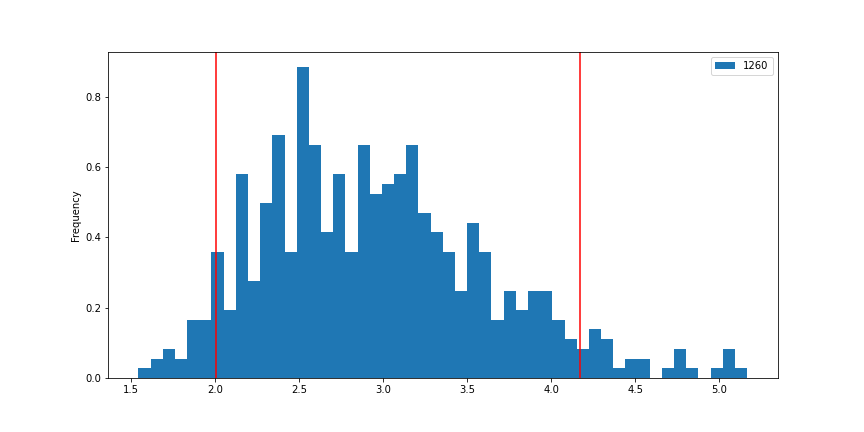

# Financial Report

## Budget Analysis:
The information for analysis on Institution ID 109508 was obtained from Plaid API. 

### Transaction Analysis
Transactions for 90 days were analyzed by creating a dataframe using the date, name, amount and category fields. The information obtained is displayed below:

* Total Expenses by Category

    |Expense Category| Amount   |
    |----------------|----------|
    |Transfer        |$20,537.34|
    |Payment         |$6,310.50 |
    |Food and Drink  |$3,406.59 |
    |Shops           |$1,500.00 |
    |Recreation      |$235.50   |
    |Travel          |$35.19    |

* Spending Categories Pie-chart

    

* Number of Transactions by Category

    

* Total Monthly Expenses

    

### Income Analysis

* Last Year's Income Before Tax was `$7,285`

* Current Monthly Income amounts to `$500`

* Projected Yearly Income Before Tax is `$7,389`

## Retirement Planning:

### Portfolio Analysis

This activity was performed using the Alpaca API to grab historical 2019 data for:

* US Aggregate Bond ETF (AGG)
* SPDR S&P 500 ETF Trust (SPY)

A `60/40` portfolio was constructed using SPY(`60%`) to represent the stock portion and AGG(`40%`) to represent the bonds. 

**Monte Carlo Simulation** was performed for `500` iterations with a retirement timeframe of `30` years.

The 90% confidence interval of projected cumulative returns is between `86.405844` and `395.786027`. 

The plot displaying 90% confidence interval for ending returns:

### Retirement Analysis

1. Expected cumulative returns at `30` years for the `10th`, `50th`, and `90th` percentiles are:
    * Tenth percentile:  100.517608
    * Fiftieth percentile: 191.768875
    * Ninetieth percentile: 342.447609

2. With an initial investment of `$20,000`, the expected return in dollars at the `10th`, `50th`, and `90th` percentiles is as follows:
    * Tenth percentile: $2,010,352.16
    * Fiftieth percentile: $3,835,377.51
    * Ninetieth percentile: $6,848,952.19

3. The current projected gross annual income from the Plaid analysis is `$7,389`. A `4%` withdrawal rate from the value at the `10th` percentile is `$80,414.09` which is much more than the amount needed on a yearly basis. 

4. A `50%` increase in the initial investment amount i.e. `$30,000` will result in an expected return in dollars at the `10th`, `50th`, and `90th` percentiles as follows:
    * Tenth percentile: $3,015,528.24
    * Fiftieth percentile: $5,753,066.26
    * Ninetieth percentile: $10,273,428.28

   Therefore, a `4%` retirement withdrawal from the value at the `10th` percentile of `$120,621.13` is phenomenally more than the current projected value of gross annual income of `$7,389` as per Plaid API data. 

### Optional Analysis

Using the Monte Carlo data, the cumulative returns at the `5%`, `50%`, and `95%` percentiles show how cumulative returns change over the life of the investment.

## Early Retirement Analysis

In this section, the initial investment has been increased to `$90,000` and the `SPY` and `AGG` tickers represent an `80/20` portfolio i.e. 80% stocks (SPY) and 20% bonds (AGG). The monte carlo model for early retirement runs for `5 years` instead of 30 years:

The 90% confidence interval of projected cumulative returns for `5 years` is between `2.005007` and `4.169354`. 

The plot displaying 90% confidence interval for ending returns:

* The expected cumulative returns at 5 years for the 10th, 50th, and 90th percentiles are:
    * Tenth percentile:   2.158642
    * Fiftieth percentile: 2.896559
    * Ninetieth percentile: 3.896136

* Given an initial investment of `$90,000`, the expected return in dollars at the `10th`, `50th`, and `90th` percentiles are:

    * Tenth percentile: $194,277.81
    * Fiftieth percentile: $260,690.31
    * Ninetieth percentile: $350,652.23

* Comparing the current projected gross annual income from the Plaid analysis `$7,389` to a `4%` withdrawal rate from the value at the `10th` percentile gives a retirement income of `$7,771.11`. 

    This shows that in order to retire early, an increase in initial investment to `$90,000` and an adjustment in portfolio mix of `80/20` i.e. a higher stock to bond ratio will generate a retirement income close to the current projected gross annual income. Such a plan will accomplish an early retirement goal of 5 years vs 30 years!
